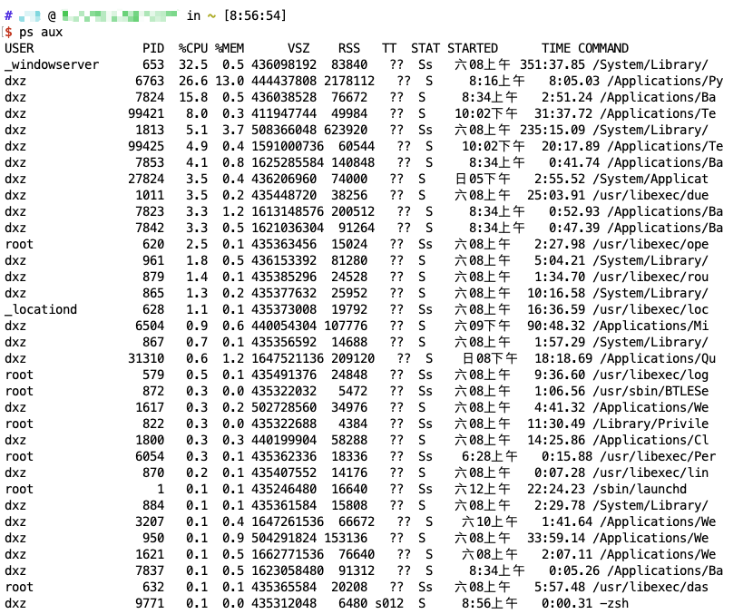

# 一、多进程编程
1. 基本概念：进程是操作系统进行资源分配和调度的基本单位，是程序在计算机上的一次执行实例。每个进程拥有独立的内存空间、文件描述符和系统资源。
2. 多进程编程是指通过代码同时启动并管理多个进程，让他们并发或并行执行不同任务，以充分利用多核CPU资源、提升程序执行效率。
3. Python中的多进程实现：python提供了**multiprocessing**模块用于多进程编程。
# 二、Linux进程相关命令
1. ``ps``：查看进程快照，列出当前系统中运行的进程（静态快照）
- ps aux：显示所有用户的所有进程
- ps -ef：以全格式显示所有进程

- ``USER``：进程所属用户
- ``PID``：进程ID（唯一标识符）
- ``%CPU``：CPU使用率
- ``%MEM``：内存使用率
- ``COMMAND``：启动进程的命令
2. ``top``：实时监控进程。动态显示系统进程状态，支持实时刷新（3s）
- P：按CPU使用率排序
- M：按内存使用率排序
- k：输入PID终止进程
- q：推出top
3. ``kill``：向进程发送信号。用于向制定进程发送信号（最常用于终止进程）
- 1（SIGHUP）：重新加载配置
- 9（SIGKILL）：强制终止进程（不可忽略）
- 15（SIGTERM）：正常终止进程（默认信号）
4. ``pkill``：根据进程名终止进程。通过进程名批量终止进程（无需手动查找PID）
5. ``pgrep``：通过进程名称查找对应的PID（仅显示ID，不终止进程）
6. ``nice/renice``：调整进程优先级
- nice：启动进程时指定优先级（-20～19，数值越小优先级越高）
- renice：调整已运行进程的优先级
7. ``jobs/fg/bg``：后台进程管理。用于管理当前终端的后台任务
# 三、Process语法结构如下：
```plaintext
Process(group,target,name,args,kwargs)
```
- target：如果传递了函数的引用，可以让这个子进程就执行这里的代码
- args：给target指定的函数传递的参数，以元组的方式传递
- kwargs：给target指定的函数传递命名参数，keyword参数
- name：给进程设定一个名字，可以不设定
- group：指定进程组，大多数情况下用不到
1. Process创建的实例对象的常用方法
   - start()：启动子进程实例（创建子进程）
   - is_alive()：判断进程子进程是否还活着
   - join([timeout])：是否等待子进程执行结束，或等待多少秒——祸首子进程尸体
   - terminate()：不管任务是否完成，立即终止子进程
2. Process创建的实例对象的常用属性
    - name：当前进程的别名，默认为Process-N，N为从1开始递增的整数
    - pid：当前进程的pid（进程号）
    - exitcode：子进程的退出码
# 四、全局解释器锁GIL
1. CPython解释器有全局解释器锁，导致多线程无法利用多核CPU进行并行计算。因此，**CPU密集型任务要用多进程**。**IO密集型任务可用多线程/协程**。
2. GIL锁：在大多数系统上，Python同时支持消息传递和基于线程的并发编程。尽管大多数程序员熟悉的往往是线程接口，但实际上Python线程受到的限制有很多。尽管最低限度是线程安全的，但Python解释器还是使用了内部的GIL，在任意指定的时刻只允许单个Python线程执行。无论系统上存在多少个可用的CPU核心，这限制了Python程序只能在一个处理器上运行。
3. Python GIL与线程的核心约束
   - CPython解释器的全局解释器锁规定：同一时刻，一个Python进程内只有一个线程能执行Python字节码。
   - 直接结论1:多线程无法实现多CPU的并行计算，不适合CPU密集型任务。
   - 直接结论2:IO密集型场景下，多线程能大幅度提升效率。因为线程在等待IO时，会主动释放GIL，其他线程可同时执行，实现并发。