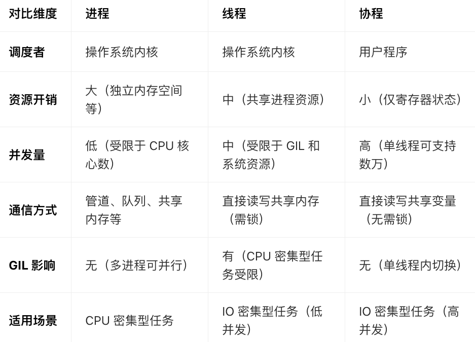
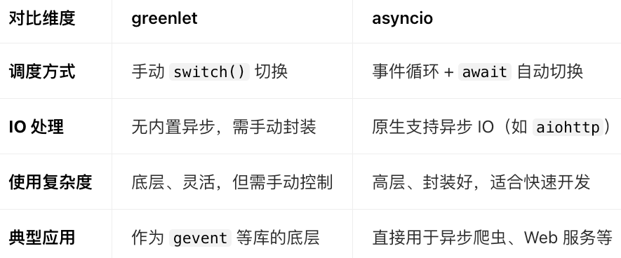
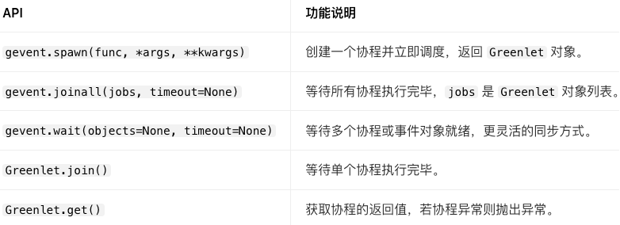
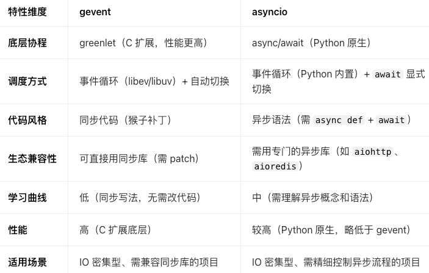

# 协程
又叫微线程。
1. 定义：协程是Python中另外一种实现多任务的方式，只不过比线程更小，占用更小执行单元(所需资源)。
    - 为什么说它是一个执行单元：因为它自带CPU上下文。这样只要在合适的时机，可以把一个协程切换到另一个协程，只要这个过程保存或回复CPU上下文，那么程序还是可以运行的。
    - 在一个线程中的某个函数，可以在任何地方保存当前函数的一些临时变量等信息，然后切换到另一个函数中执行，注意不是通过调用函数的方式做到的，并且切换的次数以及什么时候再切换到原来的函数都由开发者自己确定。
2. 协程与线程差异
   - 在实现多任务时，线程切换从系统层面远不止保存和恢复CPU上下文这么简单。操作系统为了程序运行的高效性，每个线程都有自己缓存Cache等等数据，操作系统还会帮助线程做这些数据的恢复操作。所以线程的切换非常耗性能。
   - 协程的切换只是单纯的操作CPU的上下文，所以一秒钟切换百万次系统都扛得住。

# 对比
1. 进程：进程是操作系统资源分配的最小单位，每个进程拥有独立的内存空间、文件描述符、网络端口等资源。进程间相互隔离，一个进程崩溃不会影响其他进程，但进程间通信（IPC）需要通过管道、队列、共享内存等机制，开销较大。
2. 线程：线程是CPU 调度的最小单位，一个进程可以包含多个线程，线程共享进程的内存空间和资源。线程切换由操作系统内核控制，开销比进程小，但在 Python 中由于全局解释器锁（GIL） 的存在，同一时刻只有一个线程能在 CPU 上执行，因此多线程适合IO 密集型任务（如网络请求、文件读写），不适合CPU 密集型任务（如复杂计算）。
3. 协程：协程是用户态的轻量级线程，调度完全由用户程序控制，不需要操作系统内核介入。一个线程可以包含多个协程，协程共享线程的资源，切换开销极小（仅需保存和恢复寄存器状态）。协程通过异步 IO机制，在遇到 IO 操作时主动让出 CPU，让其他协程执行，从而高效利用单线程资源，尤其适合高并发 IO 密集型场景。

# gevent

